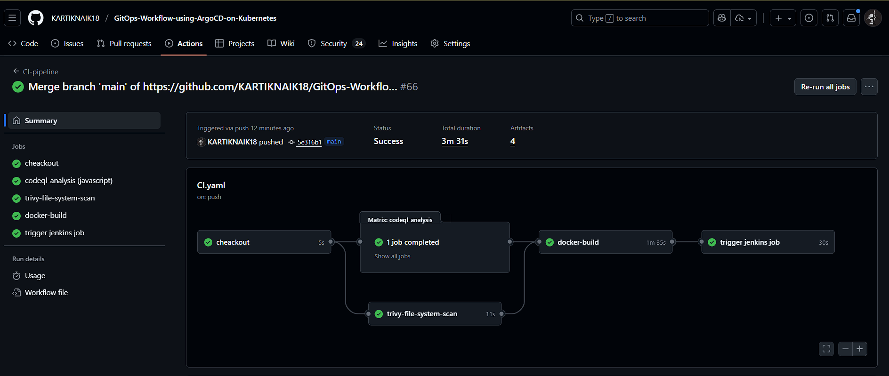
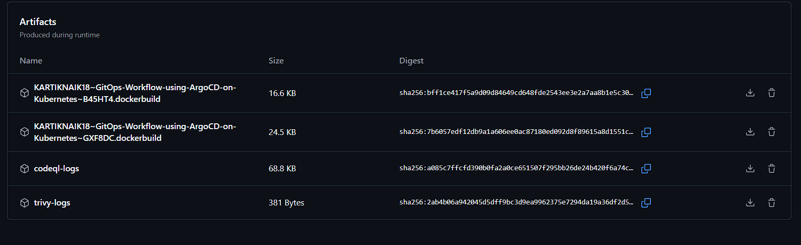
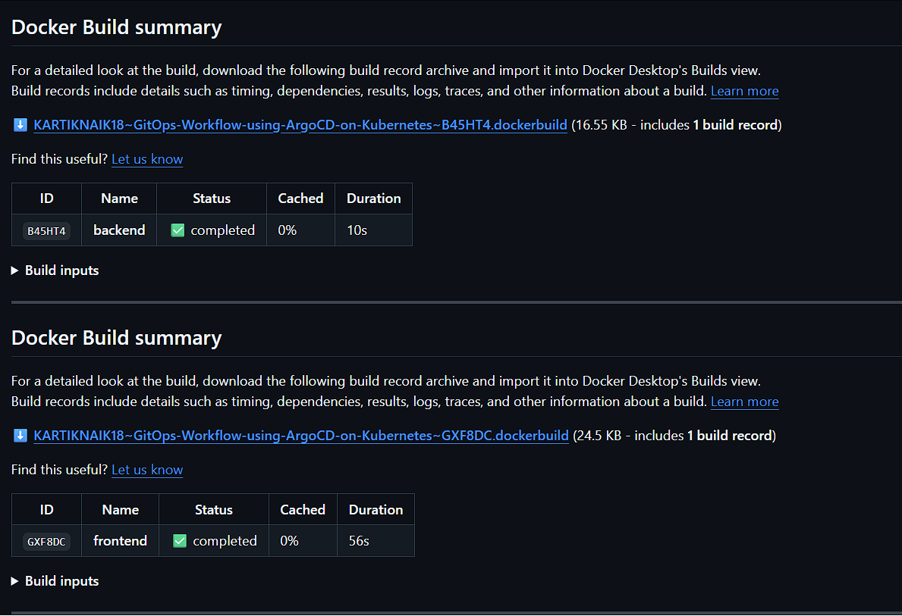
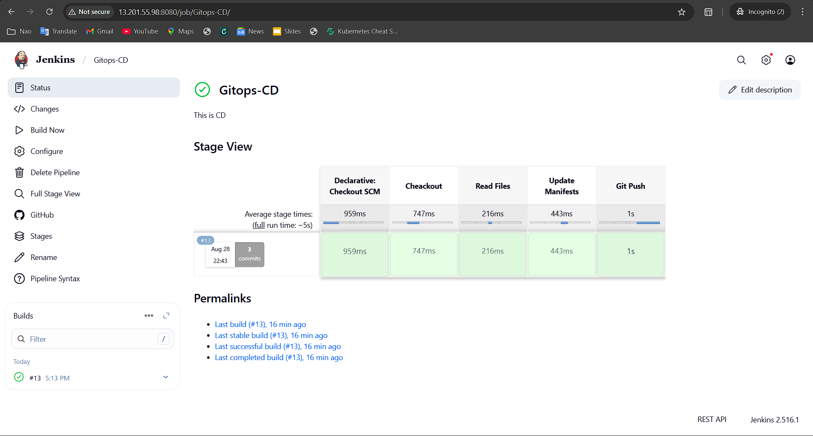
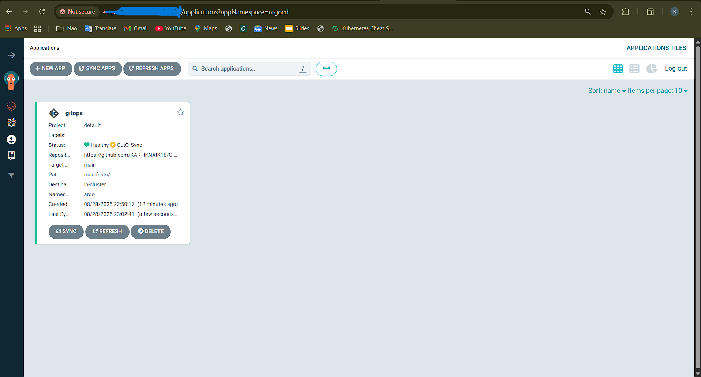
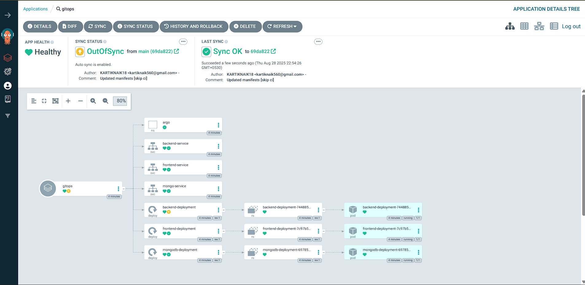
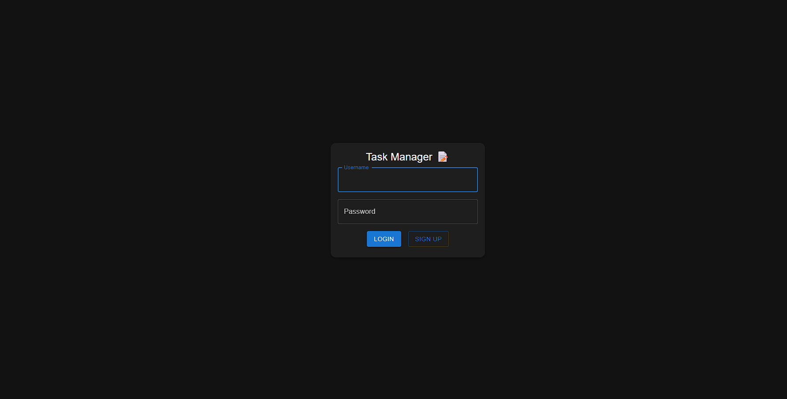
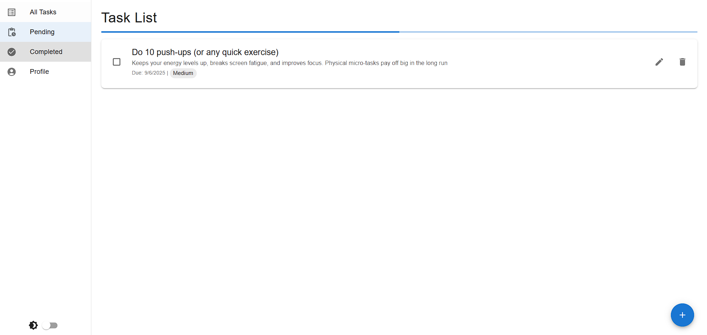
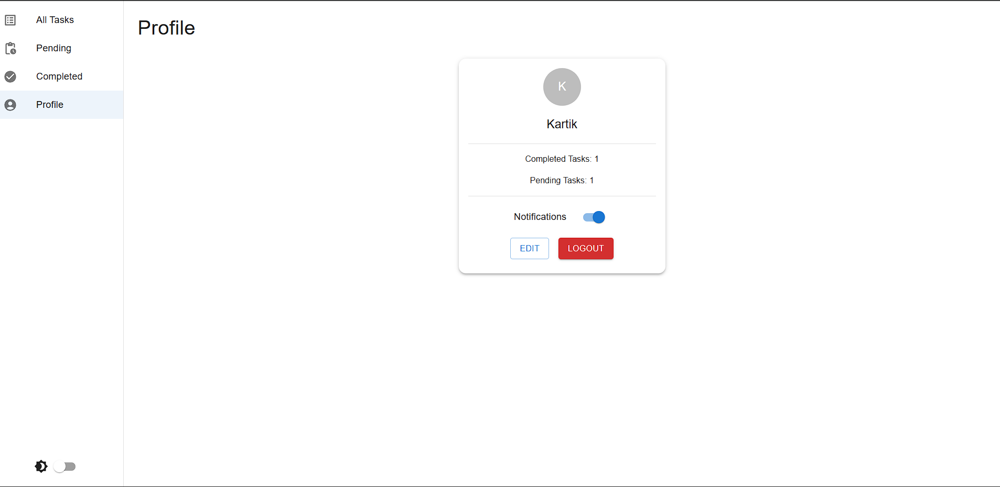
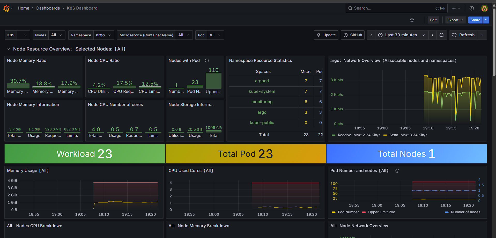

<p align="center">
  
  
  
  
  
  
</p>

<h1 align="center">Kubernetes GitOps Deployment with CI/CD Automation</h1>

<p align="center">
A production-grade <strong>GitOps-powered CI/CD pipeline</strong> for a Notes App using GitHub Actions, Jenkins, ArgoCD, Kubernetes, Docker, Prometheus & Grafana.
</p>

---

## 

This project delivers a production-grade **GitOps CI/CD pipeline** for a Notes Application, combining automation, security, and observability across every stage of deployment.

---

## 🔹 CI/CD & GitOps Flow

### **GitHub Actions**  
<p align="left">
  
</p>

- Triggers on code push to `frontend/` or `backend`  
- Runs security scans  
- Checks `version.txt`  
- Initiates Docker builds  

---

### **Security Scanning**  
<p align="left">
  
  
</p>

- **Trivy** scans for vulnerabilities  
- **CodeQL** performs static analysis  

---

### **Docker Build & Push**  
<p align="left">
  
</p>

- Builds container images only if `version.txt` changes  
- Semantic tagging  
- Pushes to registry  

---

### **Jenkins Deployment**  
<p align="left">
  
</p>

- Pulls latest Docker image  
- Updates Kubernetes manifests  
- Deploys to cluster via webhook  

---

### **ArgoCD GitOps Sync**  
<p align="left">
  
</p>

- Continuously syncs manifests from Git repo  
- Maintains desired state  
- Supports rollback  

---

## ✅ Highlights

- 🚀 Zero-touch deployment with GitOps principles  
- 🧩 Modular architecture for scalability  
- 🔐 Security-first CI (Trivy, CodeQL)  
- 📊 Real-time observability with Grafana dashboards  
- 🔄 Production-ready pipeline with rollback support  

---

## 📁 Project Structure

```plaintext
notes-app/
├── 📦 backend/       → Node.js backend service (API, business logic, Dockerfile, version.txt)
├── 🎨 frontend/      → React frontend (UI, assets, Dockerfile, version.txt)
├── 🔄 gitops/        → GitOps automation configs (Jenkins jobs)
├── 📜 manifests/     → Kubernetes manifests (Deployments, Services, Ingress, etc.)
├── 🗂️ rsc/           → Resources (monitoring configs, Grafana dashboards, images, docs)

```

## ⚙️ CI/CD Workflow


### 🔹 GitHub Actions (CI)

**Triggered on push to `frontend/` or `backend/`**

- Run Trivy FS scan  
- Run CodeQL analysis  
- Check `version.txt`  
- Build & push Docker image (if version changed)  

📸 **Screenshots:**  
📸 **Screenshots:**  

**GitHub Actions Workflow**  
  

**Build Artifacts**  
  

**Docker Build Info**  
  
 

### 🔸 Jenkins (CD)

**Triggered via GitHub Actions webhook (with secret token)**  

- Verify Docker image existence  
- Update Kubernetes manifests  
- Deploy to cluster  

📸 **Jenkins CD:** 
  

###  🔹 ArgoCD (GitOps)

- Auto-sync updated manifests from Git repo  
- Apply changes to Kubernetes  
- Maintain desired state  

📸 **ArgoCD Screenshots:**  
**ArgoCD Application View**  
  

**ArgoCD Dashboard**  
  


---

##  Application Output

🔓 **Login Page**  
  

🏠 **Home Screen**  
  

👤 **Profile View**  
  

---

##  Monitoring

📸 **Grafana Dashboard:**  
  

---

## 💡 Tips

- ✅ Enable ArgoCD Auto-Sync for zero-touch deployment  
- 🧹 Use Server-Side Apply + Prune Last for safe updates  
- 📈 Monitor app health via Grafana dashboards & Prometheus metrics  

---

<p align="center"> Made with ❤️ using GitOps principles, CI/CD automation, and cloud-native tools. </p>
